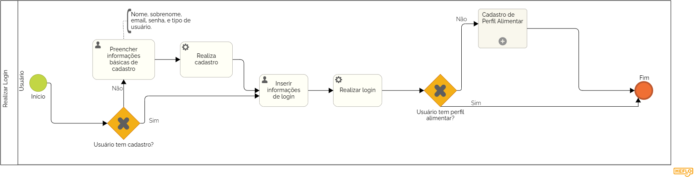

### 3.3.1 Processo 1 – Realizar Login

Processo dedicado a realizar o login do usuário, caso não tenha o 

#### Detalhamento das atividades

### Coletar informações básicas do usuário:

_Informações como nome,sobrenome,e-mail,senha,telefone,tipo de usuário._

### Verificar se o usuário já possui cadastro:

_Se sim, direcionar o usuário para a tela de login._

_Se não, direcionar o usuário para a tela de cadastro do perfil alimentar._

### Tela de login:

_Solicita ao usuário que digite seu e-mail e senha._

_Verifica se as informações digitadas estão corretas._

_Se as informações estiverem corretas, direciona o usuário para a tela principal do sistema._

_Se as informações estiverem incorretas, exibe uma mensagem de erro e solicita ao usuário que tente novamente._

**Atividade 1: Login**

| **Campo**       | **Tipo**         | **Restrições** | **Valor default** |
| ---             | ---              | ---            | ---               |
| Email | Caixa de texto  |                |                   |
| Senha | Caixa de texto  |                |                   |

| **Comandos**         |  **Destino**                   | **Tipo** |
| ---                  | ---                            | ---               |
| Confirmar | Entra com o seu perfil | (default) |
| Cadastrar | Começa o processo de cadastro | (default) |

**Atividade 2: Cadastro**

| **Campo**       | **Tipo**         | **Restrições** | **Valor default** |
| ---             | ---              | ---            | ---               |
| Nome            | Caixa de texto   |                |                   |
|Sobrenome        | Caixa de Texto   |                |                   |
| Email           | Caixa de texto   |                |                   |
| Confirmar Email | Caixa de texto   |                |                   |
| Telefone        | Caixa de texto   |                |                   |                             |
| Senha           | Caixa de texto   |Mínimo de 8 caracteres e ao menos uma letra maiúscula, uma minúscula e um carcatere especial       |                   |
| Confirmar Senha | Caixa de texto   |Mínimo de 8 caracteres e ao menos uma letra maiúscula, uma minúscula e um carcatere especial       |                   |

| **Comandos**         |  **Destino**                   | **Tipo** |
| ---                  | ---                            | ---               |
| Confirmar Cadastro | Selecionar tipo de usuário | (default) |
| Voltar | Volta para tela de Loing | (default) |

**Atividade 3: Selecionar tipo de usuário**

| **Campo**      | **Tipo**         | **Restrições**       | **Valor default** |
| ---            | ---              | ---                  | ---               |
| Usuário        | Seleção Única (Usuário / nutricionista) |                   |
