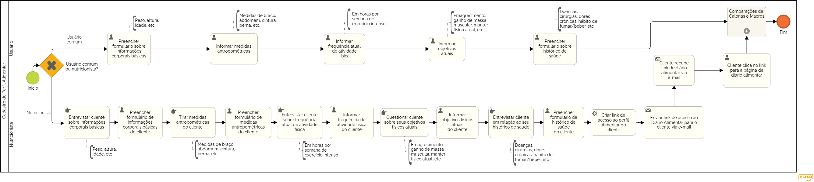

### 3.3.2 Processo 2 – Cadastro de Perfil Alimentar

A função deste processo é de identififcar as necessidades do usuário e qual seus objetivos usando a aplicação. 
Para melhorar este processo deve-se pensar de forma a fazer uma pesquisa intuitiva, rápida e eficiente com o usuário.
O processo deverá ser finalizado mostrando uma recomendação de acordo com aquilo que o usuário respondeu. 

#### Detalhamento de Atividades

### Tipo de Usuário

_O Usuário escolhe se é nutricionista ou um usuário comum._

### Usuário Comum 

_**Informaçoes corporais básicas:** Usuário preenche um formulário coms suas informações corporais basicas como peso, altura, idade..._

_**Medidas antropométricas:** Usuário informa suas medidas do braço, abdômen, cintura, perna..._

_**Objetivos atuais:** Usuário informa qual o seu objetivo seja ganhar massa muscular, emagrecimento, ficar em forma, manter fisoco atual..._

_**Historico de Saúde:** Usuário preenche formulario de historico de saude, contando com doeças, cirurgias, alergias, habito de fumar ou beber..._

_**Cálculo de macros e calorias:** Após terminar de realizar seu perfil alimentar o Usuário e encaminhado a tela de comparaçao de calorias e macronutrientes_

### Nutricionista

_**Informaçoes corporais básicas:** Após entrevista com cliente o usuário preenche um formulário com as informações corporais basicas do mesmo como peso, altura, idade..._

_**Medidas antropométricas:** Após tirar medidas de seu cliente o usuário as informa como pescoço, quadril, cintura..._

_**Frequência de atividade fisica:** Após entrevista com seu cliente o usuário informa com que frequência o mesmo se exercita._

_**Objetivos atuais:** Após questionario com seu cliente o usuário informa qual o objetivo do mesmo seja ganhar massa muscular, emagrecimento, ficar em forma, manter fisoco atual..._

_**Historico de Saúde:** Após entrevista com seu cliente o osuário preenche o formulario de historico de saude do mesmo contando com doeças, cirurgias, habito de fumar ou beber..._

_**Link acesso de perfil:** Após criar o perfil de seu cliente o usuario cria um link de acesso para que o mesmo possa acessar e acompanhar a sua dieta._

_**Envio do link:** Criado o link o usuário o envia para seu cliente disponibilisando assim seu acesso._

### Cliente

_**Acesso de perfil:** Utilizando o link de acesso o usuário pode começar a utilizar da forma que quiser._

_**Cálculo de macros e calorias:** Após ter acesso a seu perfil o usuário pode ver suas comparaçoes de macros e calorias do dia, da dieta e de suas refeições._

**Atividade 1: Preencher formulário de informações corporais básicas**

| **Campo** | **Tipo** | **Restrições** | **Valor default** |
| --- | --- | --- | --- |
| Peso | Número | Maior que zero | --- |
| Altura | Número | Maior que zero | --- |
| Idade | Número | Maior que zero | --- |
| Sexo | Seleção única | Masculino/Feminino | --- |

**Atividade 2: Informar medidas antropométricas**

| **Campo** | **Tipo** | **Restrições** | **Valor default** |
| --- | --- | --- | --- |
| Pescoço | Número | Maior que zero | --- |
| Cintura | Número | Maior que zero | --- |
| Quadril | Número | Maior que zero | --- |

**Atividade 3: Informar frequência de atividade física**

| **Campo** | **Tipo** | **Restrições** | **Valor default** |
| --- | --- | --- | --- |
| Frequência | Seleção única | Sedentário/Leve/Moderado/Ativo/Pesado | --- |

**Atividade 4: Informar objetivos**
| **Campo** | **Tipo** | **Restrições** | **Valor default** |
| --- | --- | --- | --- |
| Objetivo | Seleção única | Emagrecimento/Hipertrofia/Manter | --- |

**Atividade 5: Preencher formulário sobre histórico de saúde**

| **Campo** | **Tipo** | **Restrições** | **Valor default** |
| --- | --- | --- | --- |
| Fuma? | Seleção única | Sim/Não | --- |
| Bebe? | Seleção única | Sim/Não | --- |
| Já fez cirurgia? | Seleção única | Sim/Não | --- |
| Tem dor crônica? | Seleção única | Sim/Não | --- |
| Tem doença crônica? | Seleção única | Sim/Não | --- |

**Atividade 6: Enviar link de acesso ao Diário Alimentar para o cliente**

| **Campo** | **Tipo** | **Restrições** | **Valor default** |
| --- | --- | --- | --- |
| Compartilhar link | Seleção única | --- | --- |

**Atividade 7: Clicar no link e receber acesso ao Diário Alimentar**

| **Campo** | **Tipo** | **Restrições** | **Valor default** |
| --- | --- | --- | --- |
| Clicar no link | Seleção única | --- | --- |

| **Comandos** | **Destino** | **Tipo** |
| --- | --- | --- |
| Gerar link de acesso ao Diário Alimentar para o cliente | Criar URL de acesso direto pelo o qual o cliente do nutricionista pode acessar a página de Diário Alimentar do HappyFit | --- |

