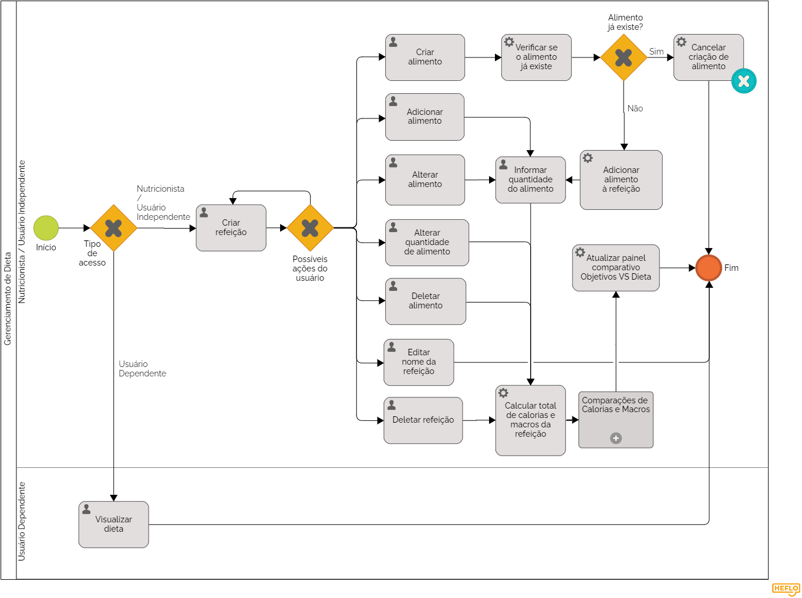

'### 3.3.3 Processo 3 – Gerenciamento de Dieta

Este processo visa proporcionar uma experiência eficiente e intuitiva para os usuários no que diz respeito à criação e gerenciamento de dietas. Uma oportunidade de melhoria seria garantir uma interface de usuário amigável e informativa, fornecendo feedback claro e útil sobre a adequação da dieta em relação às metas estabelecidas.

#### Detalhamento das atividades

### Registro de usuário

**Usuário insere dados de registro:** O usuário informa seu nome, endereço de e-mail, senha, telefone e endereço.

**Sistema verifica usuário existente:** O sistema verifica se o e-mail do usuário já existe no sistema.

**Se o usuário existir:** O sistema exibe uma mensagem informando que o e-mail já está registrado. O usuário pode tentar entrar com suas credenciais existentes ou redefinir sua senha.

**Se o usuário não existir:** O sistema prossegue para criar uma nova conta para o usuário.

### Gerenciamento de refeições

**Usuário seleciona "Criar Refeição":** O usuário seleciona a opção "Gerenciar refeições" no menu principal.

**Sistema exibe opções de gerenciamento de refeições:** O sistema exibe uma lista de opções de gerenciamento de refeições, como:

**Adicionar refeição:** O usuário pode adicionar uma nova refeição à sua dieta.

**Editar refeição:** O usuário pode editar uma refeição existente em sua dieta.

**Excluir refeição:** O usuário pode excluir uma refeição existente de sua dieta.

**Visualizar histórico de refeições:** O usuário pode visualizar um histórico de suas refeições anteriores.

**Usuário seleciona uma opção:** O usuário seleciona a opção de gerenciamento de refeição desejada.

**Sistema executa a operação selecionada:** O sistema executa a operação selecionada com base na escolha do usuário. Por exemplo, se o usuário selecionar "Adicionar refeição", o sistema exibirá um formulário para o usuário inserir os detalhes de sua nova refeição.

**Usuário insere ou edita detalhes da refeição:** O usuário insere ou edita os detalhes da refeição, como nome da refeição, itens alimentares, quantidades e informações sobre calorias e macronutrientes.

**Sistema salva detalhes da refeição:** O sistema salva os detalhes da refeição no banco de dados.

**Sistema atualiza histórico de refeições:** O sistema atualiza o histórico de refeições do usuário com as informações da refeição nova ou editada.

**Sistema exibe mensagem de confirmação:** O sistema exibe uma mensagem de confirmação informando ao usuário que a refeição foi adicionada, editada ou excluída com sucesso.

**Criar refeição**

| **Campo**       | **Tipo**         | **Restrições** | **Valor default** |
| ---             | ---              | ---            | ---               |
| Refeição | Caixa de texto | - | (default) |
**Usuário insere dados de registro:** O usuário informa seu nome, endereço de e-mail, senha, telefone e endereço.

**Editar refeição**

| **Campo**       | **Tipo**         | **Restrições** | **Valor default** |
| ---             | ---              | ---            | ---               |
| Refeição | Seleção única | - | (default) |

**Deletar refeição**

| **Campo**       | **Tipo**         | **Restrições** | **Valor default** |
| ---             | ---              | ---            | ---               |
| Refeição | Seleção única | - | (default) |

**Criar alimento**

| **Campo**       | **Tipo**         | **Restrições** | **Valor default** |
| ---             | ---              | ---            | ---               |
| Alimento | Caixa de texto | - | (default) |

**Deletar alimento**

| **Campo**       | **Tipo**         | **Restrições** | **Valor default** |
| ---             | ---              | ---            | ---               |
| Refeição | Seleção única | - | (default) |
| Alimento | Seleção única | - | (default) |

**Alterar alimento**

| **Campo**       | **Tipo**         | **Restrições** | **Valor default** |
| ---             | ---              | ---            | ---               |
| Refeição | Seleção única | - | (default) |
| Alimento | Seleção única | - | (default) |
| Quantidade | Número | Maior que zero | (default) |

**Adicionar alimento**

| **Campo**       | **Tipo**         | **Restrições** | **Valor default** |
| ---             | ---              | ---            | ---               |
| Refeição | Seleção única | - | (default) |
| Alimento | Seleção única | - | (default) |
| Quantidade | Número | Maior que zero | (default) |

**Informar quantidade do alimento**

| **Campo**       | **Tipo**         | **Restrições** | **Valor default** |
| ---             | ---              | ---            | ---               |
| Refeição | Seleção única | - | (default) |
| Alimento | Seleção única | - | (default) |
| Quantidade | Número | Maior que zero | (default) |

**Alterar quantidade de alimento**

| **Campo**       | **Tipo**         | **Restrições** | **Valor default** |
| ---             | ---              | ---            | ---               |
| Refeição | Seleção única | - | (default) |
| Alimento | Seleção única | - | (default) |
| Quantidade | Número | Maior que zero | (default) |

| **Comandos**         |  **Destino**                   | **Tipo** |
| ---                  | ---                            | ---               |
| Verificar se o alimento já existe | Busca no banco de alimentos se já existe um alimento com o mesmo nome | (default) |
| Cancelar criação de alimento | Interrompe e anula a requisição de criação de novo alimento | (default) |
| Adicionar alimento automaticamente à refeição | Adiciona o alimento recém-criado à refeição em que a caixa de criação foi aberta | (default) |
| Calcular total de calorias e macros da refeição | Soma as calorias e macros de cada alimento (baseado na quantidade do mesmo) e exibe num painel na região infeiror da caixa da refeição | (default) |
| Atualizar painel comparativo "Objetivos VS Dieta" | Recalcula a diferença entre as calorias e macros recomendados nos objetivos do usuário e o total da soma de calorias e macros de todas as refeições da dieta | (default) |
