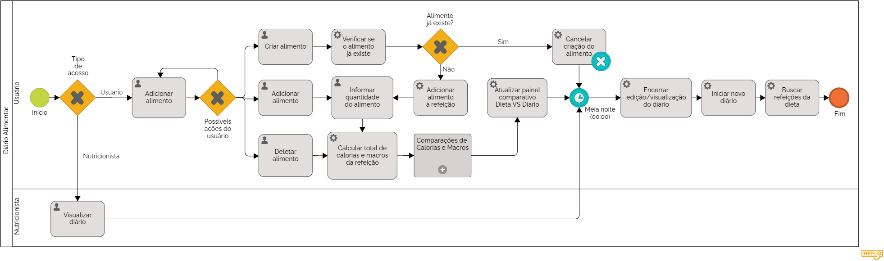

### 3.3.4 Processo 4 – Diário Alimentar

O processo abaixo busca detalhar como o acompanhamento alimentar do usuário é realizado pelo nosso sistema.
Para melhoria desse processo, o sistema deve oferecer uma interface intuitiva e mostrar um feedback claro sobre a alimentação do usuário.

#### Detalhamento das atividades

## Tela Inicial

#### A tela inicial apresenta as seguintes opções:

_**Realizar Login:** Permite que o usuário faça login no sistema utilizando seu e-mail e senha._

_**Buscar dados:** Permite que o usuário busque dados específicos no sistema._

_**Exibir relatório:** Permite que o usuário visualize um relatório com seus dados._

_**Reabrir caso:** Permite que o usuário reabra um caso que já foi finalizado._

## Tela de login

#### A tela de login apresenta os seguintes campos:

_**E-mail:** Campo onde o usuário deve digitar seu endereço de e-mail._

_**Senha:** Campo onde o usuário deve digitar sua senha._

_**Entrar:** Botão que permite que o usuário faça login no sistema._

_**Esqueci minha senha:** Link que permite que o usuário recupere sua senha caso a tenha esquecido._

## Tela de acompanhamento da dieta

#### A tela de acompanhamento da dieta apresenta as seguintes informações:

_**Data:** Data do dia em que o usuário está acompanhando sua dieta._

_**Refeições:** As três refeições principais do dia (café da manhã, almoço e jantar)._

_**Alimentos:** Os alimentos que o usuário consumiu em cada refeição._

_**Quantidade:** A quantidade de cada alimento que o usuário consumiu._

_**Calorias:** A quantidade de calorias que o usuário consumiu em cada refeição._

_**Macros:** A quantidade de macronutrientes (proteínas, carboidratos e gorduras) que o usuário consumiu em cada refeição._

_**Adicionar alimento:** Botão que permite que o usuário adicione um novo alimento à sua dieta._

_**Alterar alimento:** Botão que permite que o usuário altere um alimento que já foi adicionado à sua dieta._

_**Deletar alimento:** Botão que permite que o usuário exclua um alimento da sua dieta._

_**Calcular total de calorias e macros:** Botão que permite que o usuário calcule o total de calorias e macronutrientes que ele consumiu no dia._

_**Comparações de Calorias e Macros:** Botão que permite que o usuário compare as calorias e macronutrientes que ele consumiu no dia com as metas estabelecidas em sua dieta._

## Tela de comparação de "Dieta VS Diário"

#### A tela de comparação de "Dieta VS Diário" apresenta as seguintes informações:

_**Números da dieta:** As metas estabelecidas para cada macronutriente (proteínas, carboidratos e gorduras) na dieta do usuário._

_**Números do dia:** A quantidade de cada macronutriente que o usuário consumiu no dia._

_**Gráficos:** Gráficos que ilustram a comparação entre os números da dieta e os números do dia._

## Tela de reabertura de caso

#### A tela de reabertura de caso apresenta as seguintes opções:

_**Selecionar caso:** Permite que o usuário selecione o caso que deseja reabrir._

_**Motivo da reabertura:** Campo onde o usuário deve digitar o motivo pelo qual deseja reabrir o caso._

_**Reabrir:** Botão que permite que o usuário reabra o caso selecionado._

**Adicionar alimento**

| **Campo**       | **Tipo**         | **Restrições** | **Valor default** |
| ---             | ---              | ---            | ---               |
| Refeição | Seleção única  |                |                   |
| Alimento | Seleção única  |                |                   |
| Quantidade | Número  |        Maior que zero        |                   |

**Alterar alimento**

| **Campo**       | **Tipo**         | **Restrições** | **Valor default** |
| ---             | ---              | ---            | ---               |
| Refeição | Seleção única  |                |                   |
| Alimento | Seleção única  |                |                   |
| Quantidade | Número  |         Maior que zero       |                   |

**Alterar quantidade de alimento**

| **Campo**       | **Tipo**         | **Restrições** | **Valor default** |
| ---             | ---              | ---            | ---               |
| Refeição | Seleção única  |                |                   |
| Alimento | Seleção única  |                |                   |
| Quantidade | Número  |        Maior que zero        |                   |

**Deletar alimento**

| **Campo**       | **Tipo**         | **Restrições** | **Valor default** |
| ---             | ---              | ---            | ---               |
| Refeição | Seleção única  |                |                   |
| Alimento | Seleção única  |                |                   |

| **Comandos**         |  **Destino**                   | **Tipo** |
| ---                  | ---                            | ---               |
| Calcular total de calorias e macros da refeição | Soma as calorias e macros de cada alimento (baseado na quantidade do mesmo) e exibe num painel na região infeiror da caixa da refeição | (default) |
| Atualizar painel comparativo "Dieta VS Diário" | Recalcula a diferença entre as calorias e macros da dieta - montada no processo de Gerenciamento de Dieta - e o total da soma de calorias e macros de todas as refeições do dia | (default) |
| Exibir relatório | Bloquear edição do diário e exibir uma caixa exibindo o resultado final do painel comparativo "Dieta VS Diário" | (default) |
| Reabrir acompanhamento à meia noite do dia seguinte | Desbloquear edição do diário e apagar todos os alimentos de todas as refeições à meia noite do dia seguinte | (default) |
