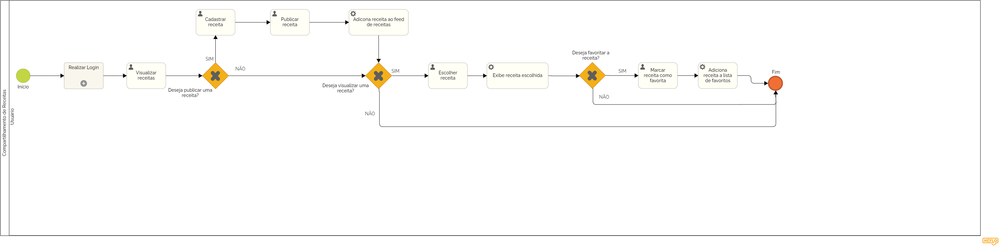

### 3.3.6 Processo 6 – Compartilhamento de Receitas

_O processo de compartilhamento de receitas proposto visa criar uma plataforma onde os usuários possam compartilhar suas próprias receitas e interagir com as receitas já publicadas. Uma oportunidade de melhoria para esse processo seria a incorporação de um algoritmo de recomendação, capaz de sugerir receitas relevantes de acordo com os interesses individuais de cada usuário. Isso tornaria a experiência de descoberta de novas receitas mais personalizada e atraente para os usuários._

#### Detalhamento das atividades

#### Cadastro de Receita:

_**Nome da receita:** O usuário digita o nome da receita no campo de texto._

_**Ingredientes:** O usuário digita os ingredientes da receita na área de texto, separando-os por vírgula ou ponto e vírgula._

_**Modo de preparo:** O usuário digita o modo de preparo da receita na área de texto, dividindo-o em etapas._

_**Rendimento:** O usuário digita o rendimento da receita na área de texto, informando a quantidade de porções._

_**Categoria:** O usuário seleciona uma ou mais categorias para a receita, utilizando a opção de seleção múltipla._

_**Imagem:** O usuário carrega uma imagem da receita, clicando no botão "Escolher imagem"._

_**Pré-visualização da Receita:** O aplicativo apresenta uma pré-visualização da receita para o usuário, permitindo que ele revise os dados antes de publicar._

**Publicação da Receita:**

_**Confirmação:** O usuário confirma a publicação da receita clicando no botão "Publicar"._

_**Armazenamento:** A receita é armazenada no banco de dados do aplicativo._

#### Pesquisar Receita:

_**Início:** O usuário digita o termo de pesquisa no campo de busca._

_**Processamento da Pesquisa:** O aplicativo utiliza mecanismos de busca para encontrar receitas que correspondam ao termo pesquisado._

_**Apresentação dos Resultados:** O aplicativo apresenta os resultados da pesquisa em uma lista ordenada por relevância._

_**Seleção da Receita:** O usuário clica na receita desejada para visualizar seus detalhes._

_**Termo de pesquisa:** O usuário digita o termo que deseja pesquisar, como nome da receita, ingrediente ou categoria._

#### Interagir com receita:

_**Visualização da Receita:** O usuário navega até a receita desejada e visualiza seus detalhes, incluindo nome, ingredientes, modo de preparo, rendimento, categoria e imagem._

_**Interações:** O usuário pode interagir com a receita de diversas maneiras:_

_**Avaliar:** O usuário pode avaliar a receita atribuindo a ela uma nota de 1 a 5 estrelas._

_**Favoritar:** O usuário pode adicionar a receita à sua lista de favoritos para acessá-la facilmente posteriormente._

_**Comentar:** O usuário pode deixar um comentário sobre a receita, compartilhando sua opinião ou experiência com o preparo._

_**Feito:** O usuário pode marcar a receita como "feita" para indicar que já a preparou._

_**Avaliar:** Atualiza a avaliação da receita com base na nota atribuída pelo usuário._

_**Favoritar:** Adiciona a receita à lista de favoritos do usuário_

**Atividade 1: Cadastro de Receita**

| **Campo**       | **Tipo**         | **Restrições** | **Valor default** |
| ---             | ---              |  ---           | ---               |
| nome da receita | Caixa de Texto   |                |                   |
| ingredientes    | Área de Texto    |                |                   |
| modo de preparo | Área de texto    |                |                   |
| rendimento      | Área de texto    |                |                   |
| categoria       | Seleção Múltipla |                |                   |
| imagem          | Imagem           |                |                   |

| **Comandos**         |  **Destino**                            | **Tipo** |
| ---                  | ---                                     | ---      |
| Adicionar receita    | inicia o processo de cadastro de receita| default  |
| Cancelar             | cancela a publicação da receita         | default  |
| Publicar             | publica a receita no feed               | default  |

**Atividade 2: Pesquisar Receita**

| **Campo**       | **Tipo**         | **Restrições** | **Valor default** |
| ---             | ---              | ---            | ---               |

| **Comandos**         |  **Destino**          | **Tipo**  |
| ---                  | ---                   | ---       |
| Pesquisar            | resultado da pesquisa | default   |
| Selecionar receita   | detalhe da receita    | default   |

**Atividade 3: Interagir com receita**

| **Campo**       | **Tipo**         | **Restrições** | **Valor default** |
| ---             | ---              | ---            | ---               |

| **Comandos** |  **Destino**                                | **Tipo** |
| ---          | ---                                         | ---      |
| Avaliar      | atualiza avaliação da receita               | default  |
| Favoritar    | adiciona receita a lista de favoritos       | default  |
| Comentar     | comentário da receita                       | default  |
| Feito        | adiciona receita a lista de receitas feitas | default  |
